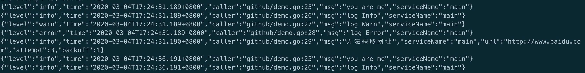
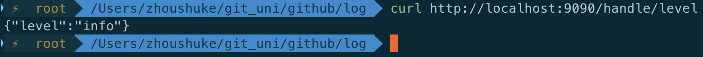
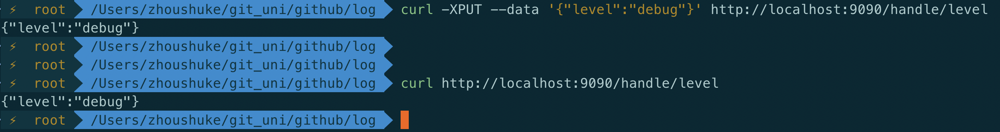
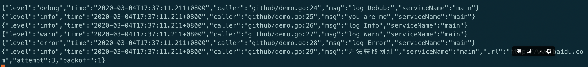
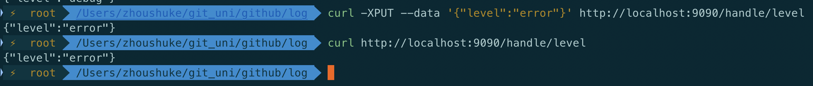
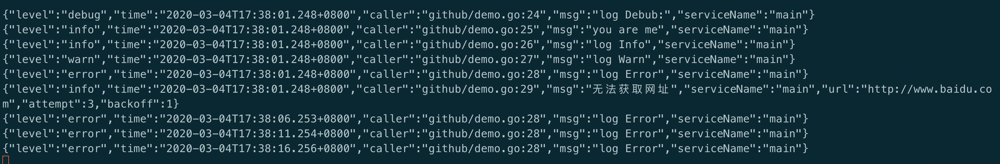
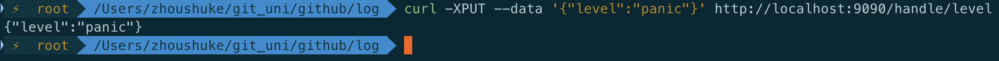
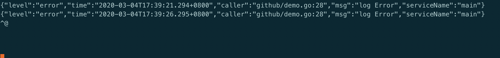

# golang下的zap日志架构的二次封装, 支持使用http接口动态修改日志级别,无需重启

启动时默认的日志级别为**info**(不会打印debug日志)

可以通过以下接口查看:
`curl localhost:9090/handle/level`
代码中已改成`curl localhost:9090/change/level`

把日志级别修改为`debug`(向下修改)

查看日志, 发现`debug`日志打印出来了, 说明动态修改生效

再把日志级别修改为`error`(向上修改)

查看日志, 只有`error`的日志打印出来

最后把日志级别修改为`panic`, 

发现不打印日志了，因为main中最高级别为`warn`

**在运行时修改日志级别还是挺有用的, 可以节省大量磁盘空间, 在出问题时**
**再通过http接口把日志级别调高, 方便排查问题, 正常情况下保持warn级别就行**
